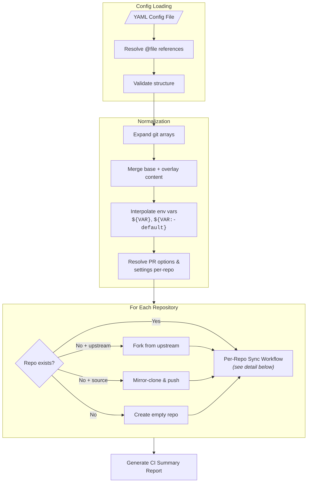
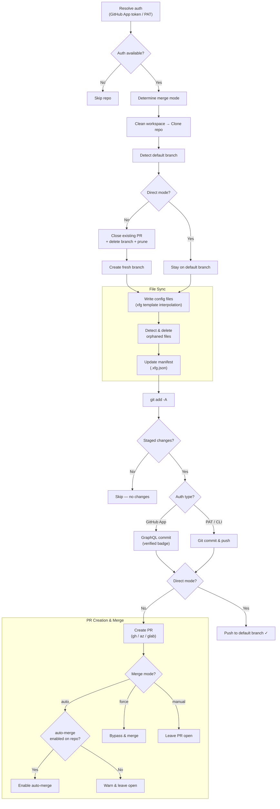
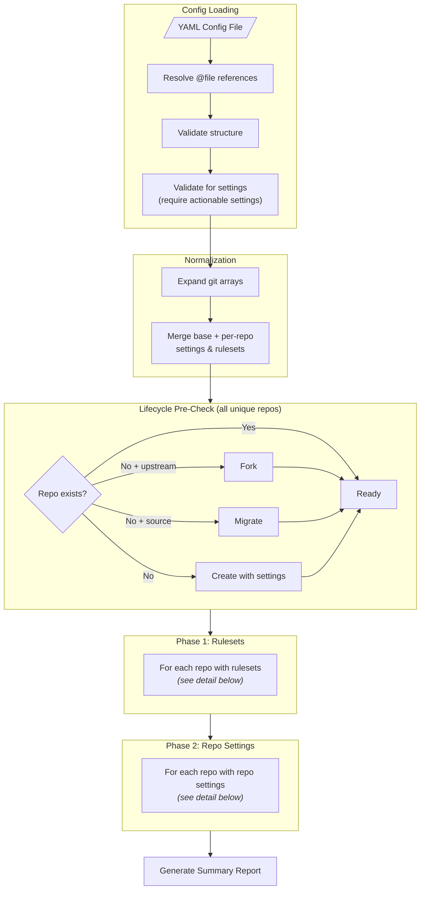
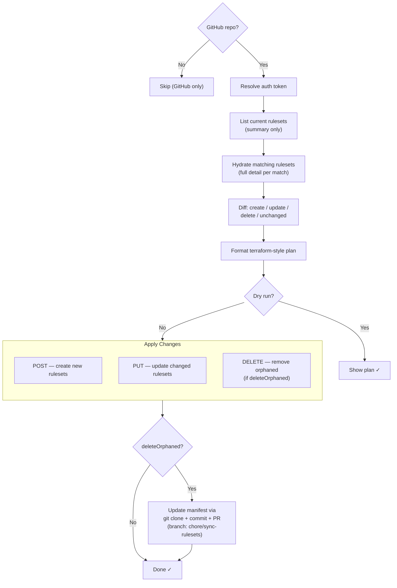
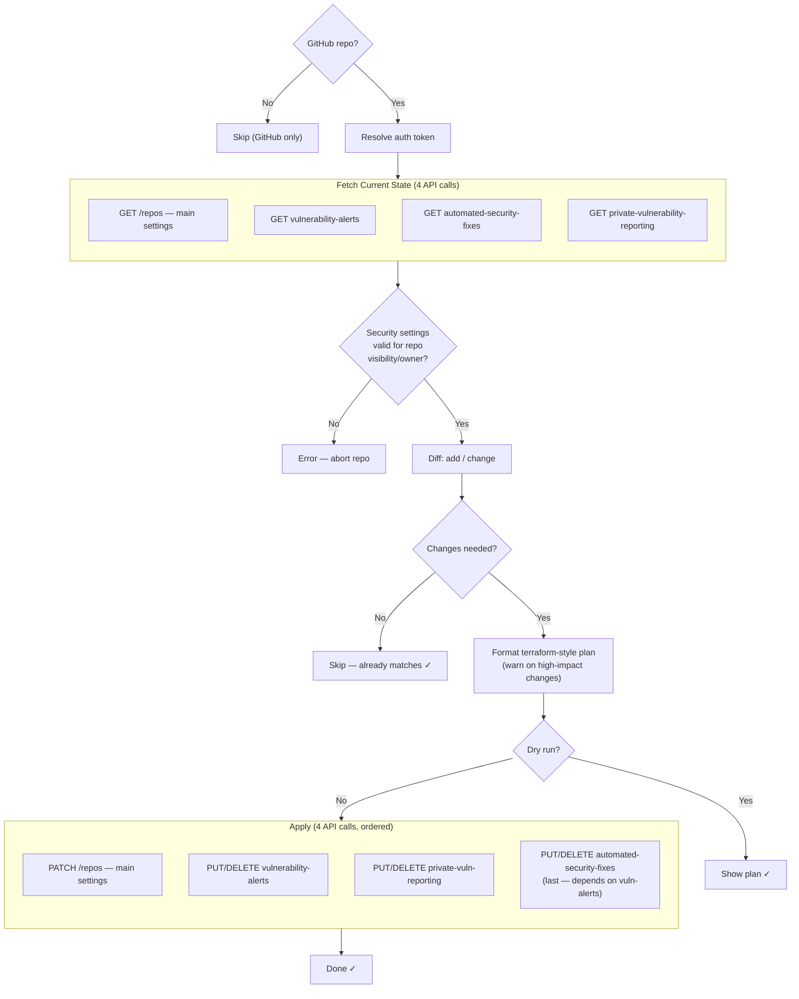

# xfg

Manage files, settings, and repositories across GitHub, Azure DevOps, and GitLab — declaratively, from a single YAML config.

Define your organization's standards once. xfg creates PRs to sync config files, applies repository settings and rulesets via API, and can even create, fork, or migrate repositories — all from one config file.

## Quick Start

```bash
# Install
npm install -g @aspruyt/xfg

# Authenticate (GitHub)
gh auth login

# Sync files across repos
xfg sync --config ./config.yaml

# Apply repository settings and rulesets
xfg settings --config ./config.yaml
```

### Example Config

```yaml
id: my-org-standards

files:
  .prettierrc.json:
    content:
      semi: false
      singleQuote: true
      tabWidth: 2

  ".github/workflows/ci.yaml":
    content:
      name: CI
      on: [push, pull_request]
      jobs:
        build:
          runs-on: ubuntu-latest
          steps:
            - uses: actions/checkout@v4
            - run: npm ci && npm test

settings:
  repo:
    allowSquashMerge: true
    deleteBranchOnMerge: true
    vulnerabilityAlerts: true
    secretScanning: true

  rulesets:
    main-protection:
      target: branch
      enforcement: active
      conditions:
        refName:
          include: [refs/heads/main]
          exclude: []
      rules:
        - type: pull_request
          parameters:
            requiredApprovingReviewCount: 1
        - type: required_status_checks
          parameters:
            requiredStatusChecks:
              - context: "ci/build"

repos:
  - git:
      - git@github.com:your-org/frontend-app.git
      - git@github.com:your-org/backend-api.git
      - git@github.com:your-org/shared-lib.git
```

**Result:** PRs are created with `.prettierrc.json` and CI workflow files, repos get standardized merge options, security settings, and branch protection rulesets.

## Features

### File Sync (`xfg sync`)

- **Multi-Format Output** - JSON, JSON5, YAML, or plain text based on filename extension
- **Subdirectory Support** - Sync files to any path (e.g., `.github/workflows/ci.yaml`)
- **Text Files** - Sync `.gitignore`, `.editorconfig`, shell scripts, etc.
- **File References** - Use `@path/to/file` to load content from external template files
- **Content Inheritance** - Define base config once, [override per-repo](configuration/inheritance.md) as needed
- **Flexible Opt-Out** - Exclude specific files per-repo, or use [`inherit: false`](configuration/inheritance.md#skipping-all-inherited-files) to skip all inherited files
- **Environment Variables** - Use `${VAR}`, `${VAR:-default}`, or `${VAR:?error}` for dynamic values
- **Merge Strategies** - Control how arrays merge ([replace, append, prepend](configuration/merge-strategies.md))
- **Orphan Deletion** - Remove files from repos when [removed from config](configuration/index.md#delete-orphaned-files)
- **YAML Comments** - Add [header comments and schema directives](configuration/content-types.md#yaml-comments) to YAML files
- **Empty Files** - Create files with no content (e.g., `.prettierignore`)
- **Create-Only Mode** - Only create files if they don't exist, never overwrite

### Templating (`${xfg:...}`)

Generate repo-specific content from a single template using [xfg template variables](configuration/templating.md):

```yaml
files:
  README.md:
    template: true
    vars:
      team: platform
    content: |
      # ${xfg:repo.name}
      Owned by ${xfg:team} | Platform: ${xfg:repo.platform}
```

**Built-in variables:** `repo.name`, `repo.owner`, `repo.fullName`, `repo.url`, `repo.platform`, `repo.host`, `file.name`, `date`

**Custom variables:** Define with `vars`, override per-repo.

### Repository Settings (`xfg settings`)

Manage [GitHub repository settings](configuration/repo-settings.md) declaratively:

- **Merge Options** - Squash, rebase, merge commit strategies; auto-delete branches; commit title/message format
- **Security** - Dependabot alerts, automated security fixes, secret scanning, push protection, private vulnerability reporting
- **Feature Toggles** - Issues, Wiki, Projects, Discussions, template repos, forking
- **Visibility** - Public, private, or internal
- **Terraform-Style Diff** - Preview changes with `+`/`~`/`-` indicators in dry-run mode
- **Opt-Out** - Use `repo: false` per-repo to skip settings for specific repos

### GitHub Rulesets

Manage [GitHub Rulesets](configuration/rulesets.md) as code:

- **20+ Rule Types** - pull_request, status_checks, signatures, code_scanning, workflows, pattern rules, file restrictions, and more
- **Bypass Actors** - Fine-grained control over which teams, users, or apps can bypass rules
- **Pattern Conditions** - Apply rules to branches/tags matching glob patterns
- **Evaluate Mode** - Test rules without enforcement
- **Inheritance** - Define defaults at root, override or [opt out](configuration/rulesets.md#single-ruleset-opt-out) per-repo
- **Orphan Deletion** - Automatically remove rulesets no longer in config

### Repo Lifecycle Management

Automatically [create, fork, or migrate](configuration/lifecycle.md) repositories before syncing:

```yaml
repos:
  # Create a new repo (if it doesn't exist)
  - git: git@github.com:my-org/new-service.git

  # Fork an open-source project
  - git: git@github.com:my-org/our-eslint-config.git
    upstream: git@github.com:airbnb/javascript.git

  # Migrate from Azure DevOps to GitHub
  - git: git@github.com:my-org/migrated-api.git
    source: https://dev.azure.com/myorg/legacy/_git/old-api
```

- **Auto-Create** - New repos created with configured settings (visibility, description, features)
- **Fork** - Fork upstream repos into your org or personal account (GitHub only)
- **Migrate** - Mirror-clone from Azure DevOps or GitLab to GitHub with all branches and tags
- **Dry-Run Support** - Preview lifecycle operations without executing them

### PR & Merge Options

Control how changes are delivered with [PR options](configuration/pr-options.md):

| Mode | Behavior |
| ---- | -------- |
| `auto` | Enable auto-merge — merge when checks pass (default) |
| `manual` | Leave PR open for manual review |
| `force` | Merge immediately, bypassing checks |
| `direct` | Push directly to default branch, no PR |

Merge strategies: `squash` (default), `merge`, `rebase`. Set globally, override per-repo, or override via CLI.

Customize PR descriptions with [PR templates](configuration/pr-templates.md) using `${xfg:pr.fileChanges}`, `${xfg:pr.fileCount}`, and other variables.

### Platform Support

| Feature | GitHub | Azure DevOps | GitLab |
| ------- | ------ | ------------ | ------ |
| File sync | Yes | Yes | Yes |
| Self-hosted | Yes (GHE) | Yes | Yes |
| Repo settings | Yes | - | - |
| Rulesets | Yes | - | - |
| Repo lifecycle | Yes | Source only | - |
| Auto-merge PRs | Yes | Yes | Yes |
| Direct push | Yes | Yes | Yes |

### Enterprise & CI/CD

- **[GitHub App Authentication](platforms/github-app.md)** - No user-tied credentials, fine-grained permissions, and verified commits with the "Verified" badge
- **GitHub Enterprise Server** - Configure custom hostnames via `githubHosts` in config
- **[GitHub Actions](ci-cd/github-actions.md)** - Official action (`anthony-spruyt/xfg@v3`) with all options as inputs
- **[Azure Pipelines](ci-cd/azure-pipelines.md)** - Run xfg in Azure DevOps pipelines
- **CI Summary Output** - Rich `GITHUB_STEP_SUMMARY` with diff-style change reports:

```text
## xfg Apply

  @@ your-org/frontend @@
  + .prettierrc.json
  ! .github/workflows/ci.yaml
  + ruleset "main-protection"

  @@ your-org/backend @@
  + .prettierrc.json
  + allowAutoMerge: true
  ! deleteBranchOnMerge: false → true

**Applied: 4 files (2 created, 2 updated), 1 ruleset (1 created), 2 settings (1 added, 1 changed)**
```

- **Dry-Run Mode** - Preview all changes without applying them (`--dry-run`)
- **Error Resilience** - Continues processing if individual repos fail
- **Automatic Retries** - Retries transient network errors with exponential backoff
- **[IDE Integration](ide-integration.md)** - JSON Schema for VS Code autocomplete and validation

## How It Works

### Sync Workflow (`xfg sync`)



#### Per-Repository Detail



### Settings Workflow (`xfg settings`)



#### Ruleset Processing (per repo)



#### Repo Settings Processing (per repo)



**See [Use Cases](use-cases.md)** for real-world scenarios: platform engineering, CI/CD standardization, security governance, repo migration, and more.
