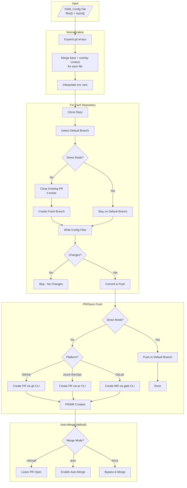

# xfg

A CLI tool for repository-as-code. Sync files and manage settings across GitHub, Azure DevOps, and GitLab.

**Two commands, one config:**

- **`xfg sync`** - Sync JSON, YAML, or text files across repos via PRs
- **`xfg settings`** - Manage GitHub Rulesets declaratively

## Quick Start

```bash
# Install
npm install -g @aspruyt/xfg

# Authenticate (GitHub)
gh auth login

# Create config.yaml
cat > config.yaml << 'EOF'
files:
  .prettierrc.json:
    content:
      semi: false
      singleQuote: true
      tabWidth: 2

settings:
  rulesets:
    main-protection:
      target: branch
      enforcement: active
      conditions:
        refName:
          include: [refs/heads/main]
      rules:
        - type: pull_request
          parameters:
            requiredApprovingReviewCount: 1

repos:
  - git:
      - git@github.com:your-org/frontend-app.git
      - git@github.com:your-org/backend-api.git
      - git@github.com:your-org/shared-lib.git
EOF

# Sync files
xfg sync --config ./config.yaml

# Apply rulesets
xfg settings --config ./config.yaml
```

**Result:** PRs are created with `.prettierrc.json` files, and all repos get identical branch protection rules.

## Features

### File Sync (`xfg sync`)

- **Multi-File Sync** - Sync multiple config files in a single run
- **Multi-Format Output** - JSON, YAML, or plain text based on filename extension
- **Subdirectory Support** - Sync files to any path (e.g., `.github/workflows/ci.yaml`)
- **Text Files** - Sync `.gitignore`, `.markdownlintignore`, etc. with string or lines array
- **File References** - Use `@path/to/file` to load content from external template files
- **Content Inheritance** - Define base config once, override per-repo as needed
- **Multi-Repo Targeting** - Apply same config to multiple repos with array syntax
- **Environment Variables** - Use `${VAR}` syntax for dynamic values
- **Merge Strategies** - Control how arrays merge (replace, append, prepend)
- **Override Mode** - Skip merging entirely for specific repos
- **Empty Files** - Create files with no content (e.g., `.prettierignore`)
- **YAML Comments** - Add header comments and schema directives to YAML files

### GitHub Rulesets (`xfg settings`)

- **Declarative Rulesets** - Define GitHub Rulesets in YAML, apply with a single command
- **Full API Coverage** - All rule types: pull_request, status_checks, signatures, code_scanning, and more
- **Bypass Actors** - Configure which teams, users, or apps can bypass rules
- **Pattern Conditions** - Apply rules to branches/tags matching glob patterns
- **Evaluate Mode** - Test rules without enforcement
- **Orphan Deletion** - Automatically remove rulesets not in config

### Platform & Operations

- **Multi-Platform** - Works with GitHub, Azure DevOps, and GitLab (including self-hosted)
- **Auto-Merge PRs** - Automatically merge PRs when checks pass, or force merge with admin privileges
- **Direct Push Mode** - Push directly to default branch without creating PRs
- **Dry-Run Mode** - Preview changes without making them
- **Error Resilience** - Continues processing if individual repos fail
- **Automatic Retries** - Retries transient network errors with exponential backoff

**See [Use Cases](use-cases.md)** for real-world scenarios: platform engineering, CI/CD standardization, security governance, and more.

## How It Works



For each repository in the config, the tool:

1. Expands git URL arrays into individual entries
2. For each file, merges base content with per-repo overlay
3. Interpolates environment variables
4. Cleans the temporary workspace
5. Clones the repository
6. Detects the default branch (main/master)
7. **PR modes:** Closes any existing PR on the branch and creates a fresh branch | **Direct mode:** Stays on default branch
8. Writes all config files (JSON, JSON5, YAML, or text based on filename extension)
9. Checks for changes (skips if no changes)
10. Commits and pushes changes
11. **PR modes:** Creates a pull request and handles auto-merge | **Direct mode:** Done (changes are on default branch)
