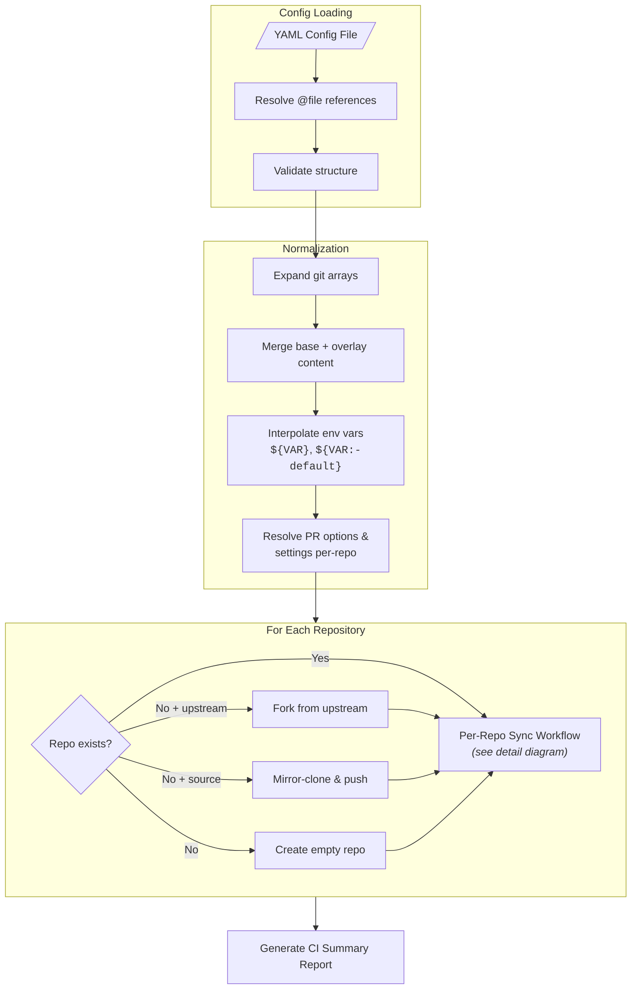
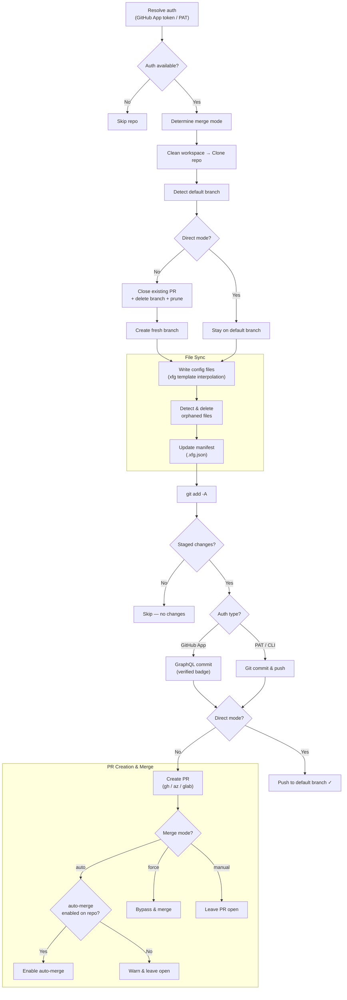
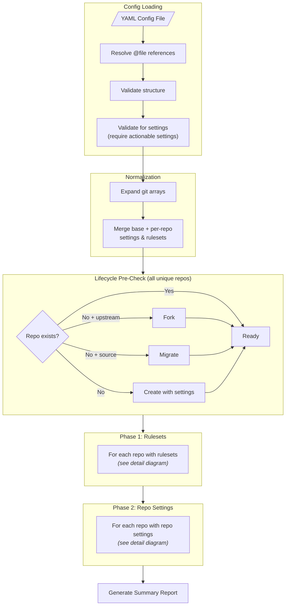
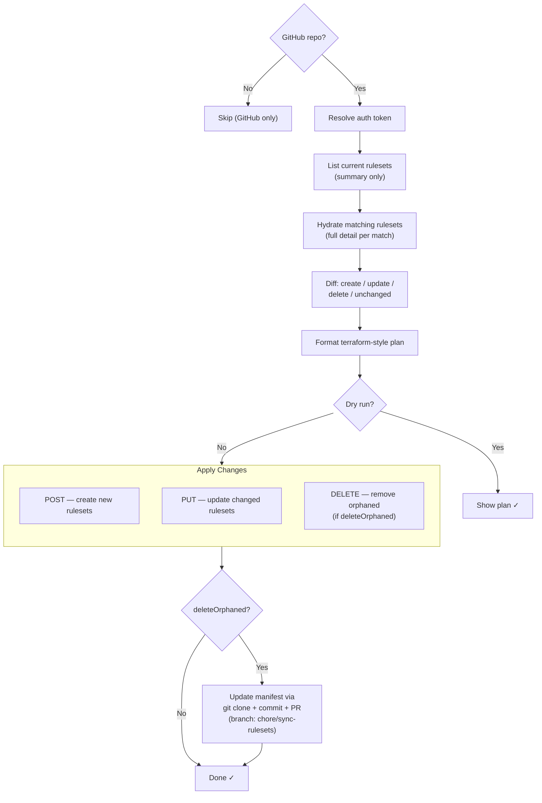
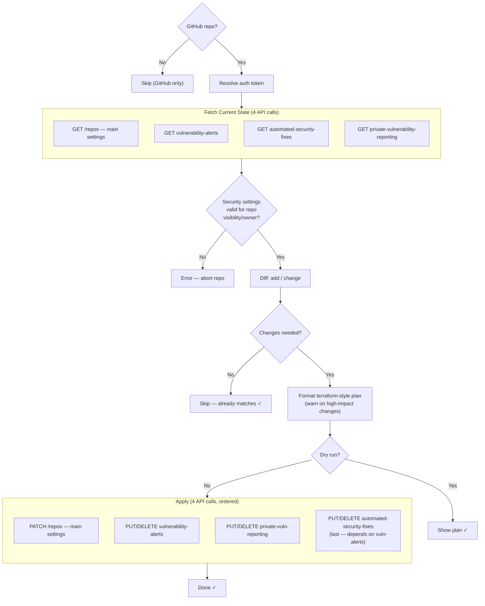

# Design: Rewrite Stale Mermaid Diagrams in docs/index.md

**Date:** 2026-02-18

## Problem

The two mermaid diagrams in `docs/index.md` (sync workflow and settings workflow) are stale and inaccurate compared to the actual codebase. Multiple steps are missing, some steps are in the wrong order, and the settings diagram collapses two independent processing phases into one.

## Approach

Replace both diagrams with an **overview + detail** structure:

- **Sync:** 1 overview diagram + 1 per-repo detail diagram
- **Settings:** 1 overview diagram + 2 detail diagrams (ruleset processing, repo settings processing)

This matches the actual code architecture (phases → per-repo loops) and gives readers both orientation and accuracy.

## Sync Diagram Issues Found

### Missing steps

1. `@file` reference resolution before normalization
2. Auth resolution as first per-repo step (can skip entire repo)
3. xfg template interpolation at write time (not during normalization)
4. Orphan detection & deletion after file writing
5. Manifest `.xfg.json` update committed alongside config files
6. Two commit strategies: Git (PAT) vs GraphQL (GitHub App, verified badge)
7. `auto` merge checks `allow_auto_merge` repo setting before enabling

### Structural issue

Direct mode push shown in PR subgraph but actually returns early from SyncWorkflow after commit — never enters PR logic.

## Settings Diagram Issues Found

### Missing steps

1. Two-pass validation: `validateRawConfig` + `validateForSettings`
2. Two separate processing phases: rulesets first, then repo settings
3. Security settings validation between fetch and diff
4. Ruleset two-pass fetch: summary list, then individual GET per match
5. Manifest update via full git clone+commit+PR for rulesets when `deleteOrphaned`

### Inaccurate

- Lifecycle only shows "Create Repo" but supports fork and migrate
- "Apply via GitHub API" is actually 4 separate ordered API calls for repo settings

## Approved Diagrams

### Sync Overview

### Sync Per-Repo Detail

### Settings Overview

### Ruleset Processing Detail (per repo)

### Repo Settings Processing Detail (per repo)

