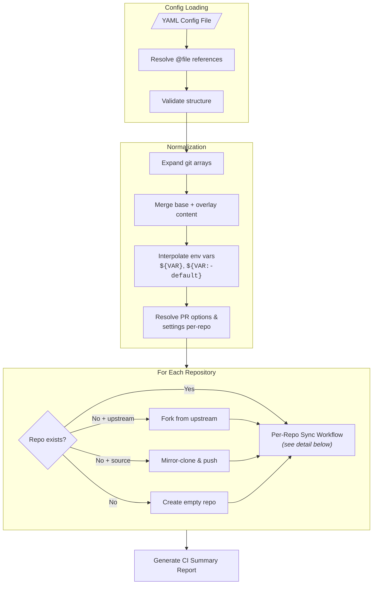
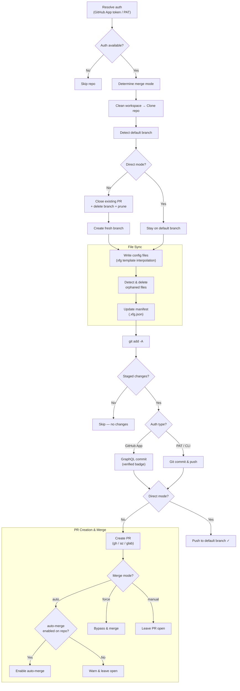
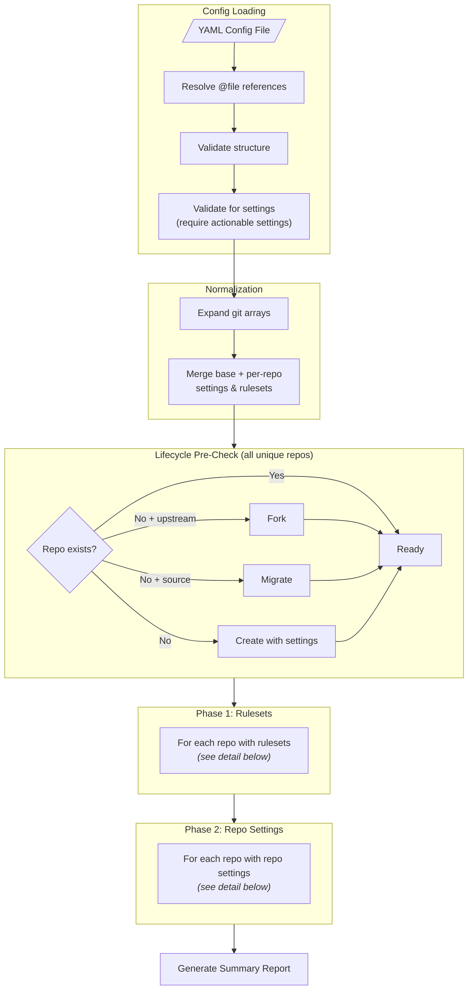
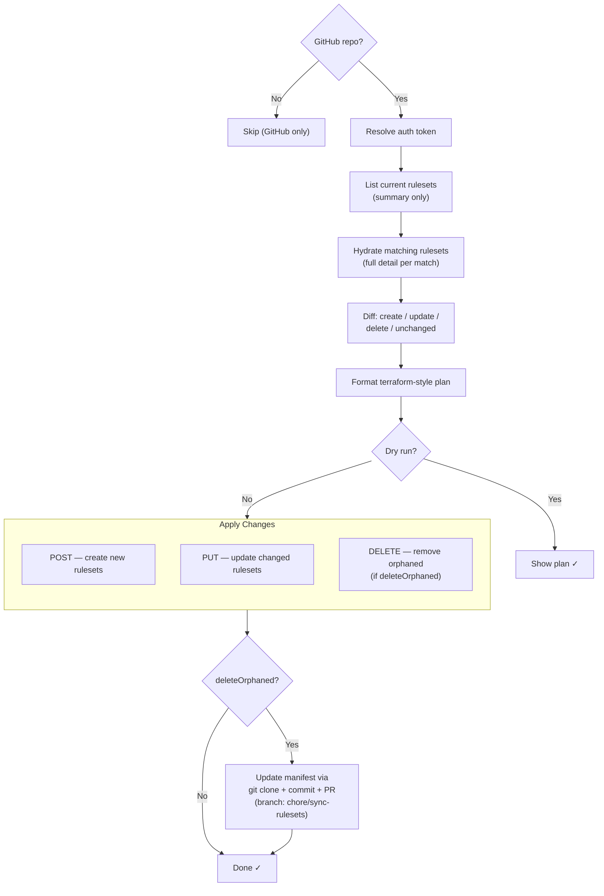
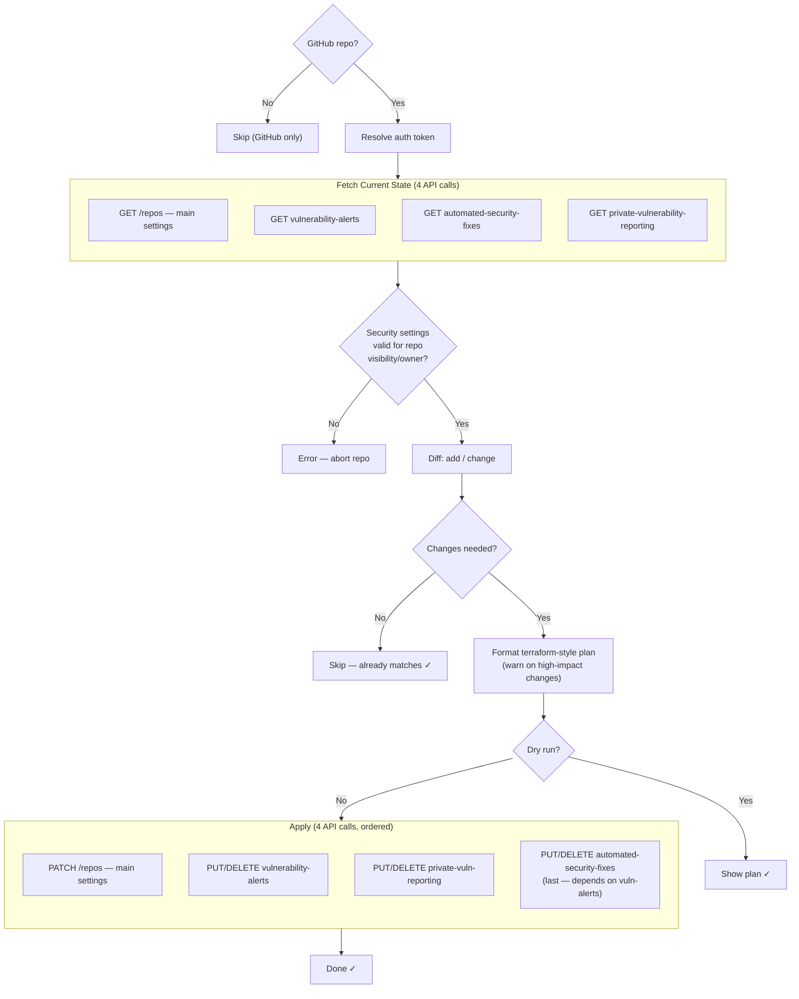

# Mermaid Diagram Rewrite Implementation Plan

> **For Claude:** REQUIRED SUB-SKILL: Use superpowers:executing-plans to implement this plan task-by-task.

**Goal:** Replace the two stale mermaid diagrams in `docs/index.md` with accurate overview + detail diagrams for both sync and settings workflows.

**Architecture:** Single file edit — replace lines 216-314 of `docs/index.md` with new "How It Works" section containing 6 mermaid diagrams (2 sync + 1 settings overview + 2 settings details + section headers).

**Tech Stack:** Mermaid flowcharts, Markdown

---

### Task 1: Replace Sync Workflow Diagrams

**Files:**

- Modify: `docs/index.md:216-277` (the "How It Works" heading + sync mermaid block)

**Step 1: Replace the sync section**

Replace lines 216-277 (from `## How It Works` through the sync mermaid closing ` ``` `) with:

````markdown
## How It Works

### Sync Workflow (`xfg sync`)

#### Overview



#### Per-Repository Detail


````

**Step 2: Verify the edit preserved surrounding content**

Read `docs/index.md` around line 215 to confirm the `## How It Works` heading is intact and the new diagrams are present. Read the lines after the sync diagrams to confirm the settings section heading follows.

**Step 3: Commit**

```bash
git add docs/index.md
git commit -m "docs: replace stale sync workflow mermaid diagrams"
```

---

### Task 2: Replace Settings Workflow Diagrams

**Files:**

- Modify: `docs/index.md` (the settings mermaid block — formerly lines 279-314, now shifted by the Task 1 edit)

**Step 1: Replace the settings section**

Find and replace the old settings section (from `### Settings Workflow` through the closing ` ``` ` and the "See Use Cases" line) with:

````markdown
### Settings Workflow (`xfg settings`)

#### Overview



#### Ruleset Processing (per repo)



#### Repo Settings Processing (per repo)



**See [Use Cases](use-cases.md)** for real-world scenarios: platform engineering, CI/CD standardization, security governance, repo migration, and more.
````

**Step 2: Verify the edit preserved surrounding content**

Read the end of `docs/index.md` to confirm the "See Use Cases" link is the last line and no content was lost.

**Step 3: Commit**

```bash
git add docs/index.md
git commit -m "docs: replace stale settings workflow mermaid diagrams"
```

---

### Task 3: Validate Mermaid Syntax

**Step 1: Check all mermaid blocks parse correctly**

Run a quick syntax check on each mermaid block. Use `npx @mermaid-js/mermaid-cli` or equivalent to validate the 6 diagrams render without errors.

```bash
npx -y @mermaid-js/mermaid-cli mmdc -i docs/index.md -o /tmp/mermaid-test.md
```

If `mmdc` reports errors, fix the mermaid syntax in the failing block.

**Step 2: Commit any fixes**

```bash
git add docs/index.md
git commit -m "fix(docs): correct mermaid syntax errors"
```

---

### Task 4: Final Review

**Step 1: Read the complete "How It Works" section**

Read the full section from `## How It Works` to the end of the file to verify:

- All 6 diagrams are present (2 sync + 1 settings overview + 2 settings detail + section headers)
- Section headings use correct hierarchy (##, ###, ####)
- No orphaned content from the old diagrams remains
- The "See Use Cases" link is intact at the end

**Step 2: Run lint**

```bash
./lint.sh
```

Fix any lint errors in `docs/index.md`.

**Step 3: Final commit if needed**

```bash
git add docs/index.md
git commit -m "docs: fix lint issues in mermaid diagrams"
```
